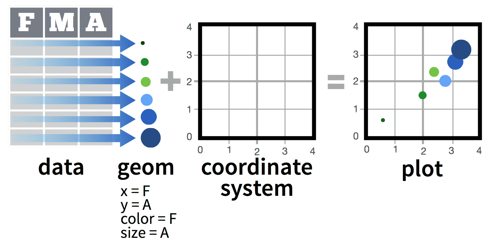

```{r, include = FALSE, warning = FALSE, message = FALSE}
# Load packages 
if(!require(pacman)) install.packages("pacman")
pacman::p_load(tidyverse, gapminder, plotly, kableExtra, knitr, here)

# Source functions 
source(here("global/functions/misc_functions.R"))

# Source autograder script quietly 
#mute(here("ch_03_intro_to_data_viz/lessons/03_gg_basics.R"))
```

# Bubble plots, scales, and {plotly}


# demo


We will start with a regular scatter plot showing the relationship between two numerical variables, and then make it a bubble plot by adding a third dimension.


- change this image
- link video


First consider this scatter plot, which plots this for all 142 countries in the data frame:


{width="482"}


# ggplotly 


# Bubble plot
A bubble plot is a type of scatter plot where a third dimension is added: the value of an additional numeric variable is represented through the size of the points.


We will recreate this bubble plot in R using {ggplot2}. 

With {ggplot2}, bubble plots are built using the `geom_point()` function. At least three arguments must be provided to `aes()`: `x`, `y` and `size`.

{width="482"}

So let's add an additional variable, `population`, and map it to the size aesthetic.

```{r}
gapminder_plot_02 <- ggplot(
  data = gapminder07,
  mapping = aes(
    x = gdp_per_capita,
    y = life_expectancy,
    size = population
  )
) +
  geom_point()

gapminder_plot_02
```

Here, the population of each country is represented through point size. The legend will automatically be built by {ggplo2}, showing how point size scales with population size.

Many of the points are overlapping, so we will add the `alpha` argument as a fixed aesthetic to decrease the opacity of the points:

```{r}
gapminder_plot_03 <- ggplot(
  data = gapminder07,
  mapping = aes(
    x = gdp_per_capita,
    y = life_expectancy,
    size = population
  )
) +
  geom_point(alpha = 0.5)

gapminder_plot_03
```


Since we have one more variable in our dataset, why not showing it using point color? Here, the `continent` variable is used to control `color` mapping:

```{r}
ggplot(
  data = gapminder07,
  mapping = aes(
    x = gdp_per_capita,
    y = life_expectancy,
    size = population,
    color = continent
  )
) +
  geom_point(alpha = 0.5) +
  scale_size(range = c(1, 20))

```

you may need to zoom/pop out
# Final plotly
```{r fig.cap="A presentation-ready scatterplot of Life expectancy over GDP per capita in 2007.", fig.height=2.95, purl=FALSE}

gapminder_plot <- ggplot(
  data = gapminder07,
  mapping = aes(
    x = gdp_per_capita,
    y = life_expectancy,
    text = country)) + # text argument secretly adds country label to each point, which won't be visible in the normal ggplot but it will show up as cover text in the interactive plot made by plotly
  scale_x_log10(labels = scales::dollar) + # labels argument adds $ signs
  geom_point(aes(size = population, 
                 fill = continent), 
             shape = 21, 
             color = "white", 
             alpha = 0.8) +
  scale_fill_brewer(palette = "Set2") + # uses palette from RColorBrewer package
  scale_size(range = c(1, 20)) +
  labs(title = "Relationship between life expectancy and income, 2007",
       x = "GDP per capita (USD)",
       y = "Life expectency (years)",
       fill = "Continent") +
  guides(size = "none") + # removes size legend
  theme_bw() # lighter theme
gapminder_plot

```

## Introduction

A bubble plot is a type of scatter plot where a third dimension is added: the value of an additional numeric variable is represented through the size of the points.


## Gapminder data

In this lesson, we will be using the `gapminder` dataset again, but only the data from 2007.

```{r}
# Import data frame from gapminder package
gapminder07 <- gapminder::gapminder %>%
  # filter data frame to only include data from 2007
  filter(year == 2007) %>%
  # remove the year column
  select(-year) %>%
  # rename columns to make them easier to understand
  rename(life_expectancy = lifeExp,
         population = pop,
         gdp_per_capita = gdpPercap) %>% 
  # reorder dataset by population size (this will be useful later)
  arrange(desc(population))

gapminder07
```


We will start with a regular scatter plot showing the relationship between two numerical variables, and then make it a bubble plot by adding a third dimension.

Let's say we want to view the relationship between life expectancy and GPD per capita.

First consider this scatter plot, which plots this for all 142 countries in the data frame:

```{r}

ggplot(
  data = gapminder07,
  mapping = aes(
    x = gdp_per_capita,
    y = life_expectancy)
) +
  geom_point()
```

Let's view this plot through the grammar of graphics:

1.  The `geom`etric objects - visual marks that represent the data - are points.
2.  The `data` variable **gdp_per_capita** gets mapped to the `x`-position `aes`thetic of the points.
3.  The `data` variable **life_expectancy** gets mapped to the `y`-position `aes`thetic of the points.


What we have created is a simple scatterplot by adding together the following components:

{width="482"}


```{r}
# Ignore for now
ggplotly(gap_plot_01)
```

## Bubble plots with `geom_point()`

With {ggplot2}, bubble plots are built using the `geom_point()` function. At least three arguments must be provided to `aes()`: `x`, `y` and `size`.

So let's add an additional variable, `population`, and map it to the size aesthetic.

```{r}
gapminder_plot_02 <- ggplot(
  data = gapminder07,
  mapping = aes(
    x = gdp_per_capita,
    y = life_expectancy,
    size = population
  )
) +
  geom_point()

gapminder_plot_02
```

Here, the population of each country is represented through point size. The legend will automatically be built by {ggplo2}, showing how point size scales with population size.

Many of the points are overlapping, so we will add the `alpha` argument as a fixed aesthetic to decrease the opacity of the points:

```{r}
gapminder_plot_03 <- ggplot(
  data = gapminder07,
  mapping = aes(
    x = gdp_per_capita,
    y = life_expectancy,
    size = population
  )
) +
  geom_point(alpha = 0.5)

gapminder_plot_03
```

Much better!

## Modifying scales

(introduce `scale_*()` functions)

(GG layers image/gif)

### Control point size with `scale_size()`

we need to improve on the previous plot is the bubble size. `scale_size()` allows to set the size of the smallest and the biggest point using the `range` argument.

```{r}
gapminder_plot_04 <- ggplot(
  data = gapminder07,
  mapping = aes(
    x = gdp_per_capita,
    y = life_expectancy,
    size = population
  )
) +
  geom_point(alpha = 0.5) +
  scale_size(range = c(1, 20))

gapminder_plot_04
```


## Changing design elements with `theme_*()` functions (CUT?)


```{r fig.cap="A presentation-ready scatterplot of Life expectancy over GDP per capita in 2007.", fig.height=2.95, purl=FALSE}

gapminder_plot <- ggplot(
  data = gapminder07,
  mapping = aes(
    x = gdp_per_capita,
    y = life_expectancy,
    label = country)) + 
  scale_x_log10(labels = scales::dollar) + # labels argument adds $ signs
  geom_point(aes(size = population, 
                 fill = continent), 
             shape = 21, 
             color = "white", 
             alpha = 0.8) +
  scale_fill_brewer(palette = "Set2") + # uses palette from Rcolorbrewer package
  scale_size(range = c(1, 20)) +
  labs(title = "Relationship between life expectancy and income, 2007",
       x = "GDP per capita (USD)",
       y = "Life expectency (years)",
       fill = "continent") +
  guides(size = "none") + # removes size legend
  theme_bw() # lighter theme
gapminder_plot

```

```{r}

ggplotly(gapminder_plot)
```

## Contributors {.unlisted .unnumbered}

The following team members contributed to this lesson: `r tgc_contributors_list(ids = c("joy", "admin"))`

## References {.unlisted .unnumbered}

Some material in this lesson was adapted from the following sources:

-   Ismay, Chester, and Albert Y. Kim. 2022. *A ModernDive into R and the Tidyverse*. <https://moderndive.com/>.
-   Kabacoff, Rob. 2020. *Data Visualization with R*. <https://rkabacoff.github.io/datavis/>.
-   Giroux-Bougard, Xavier, Maxwell Farrell, Amanda Winegardner, Étienne Low-Decarie and Monica Granados. 2020. *Workshop 3: Introduction to Data Visualisation with Ggplot2*. <http://r.qcbs.ca/workshop03/book-en/>.

`r tgc_license()`
