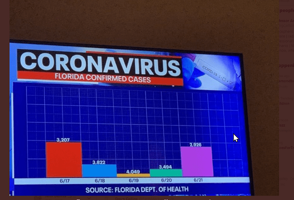

```{r echo = F, warning = F, message = F}
knitr::opts_chunk$set(echo = F, message = F, warning = F)

if (!require(pacman)) install.packages("pacman")
pacman::p_load(tidyverse,
               reactable,
               here,
               downloadthis)


table_and_download <- function(df, name){
  
  
  out_file_path <- here("data_for_download", paste0( name, ".csv"))
  write_csv(x = df, file = out_file_path)
  
  
  browsable(tagList(
    downloadthis::download_file(path = out_file_path, output_name = name),
    
    reactable::reactable(df, 
                         elementId = paste0(name, "-download-table"),
                         defaultPageSize = 5, 
                         striped = TRUE,
                         highlight = TRUE,
                         resizable = TRUE,
                         defaultColDef = reactable::colDef(align = "left", 
                                                           html = TRUE, 
                                                           class = "border-left", 
                                                           na = "NA"), 
                         wrap = FALSE,
                         bordered = TRUE,
                         theme = reactable::reactableTheme(stripedColor = "#f2f7f7", 
                                                           cellPadding = "2px 5px 2px 5px", 
                                                           borderColor = "#e1f2f2", 
                                                           borderWidth = "1.5px")))
  )
}


```

# R for Busy People Workshop 1 Exercise 2

# Part 1: Data wrangling

For each of the datasets below, try to describe in words how you would achieve the data request described.

Of course, you don't yet know how to data wrangle (in R), so how can you do this?

You can:

-   Think about how you would achieve the task manually?

-   How you achieve it with spreadsheet software like Excel

-   How you would achieve it with another programming language that you know (STATA, SPSS)

-   Or some combination of the above.

### Dataset 1: Anonymized quiz data from our course

Clinical data from children in Burkina Faso attending to the hospital for fever-causing illnesses. We would like to count the number of people who had at least four symptoms.

```{r echo = F}
bf_dat <-  read_csv(here("week_01/data/febrile_diseases_burkina_faso - Sheet1.csv"))
reactable::reactable(bf_dat)
```

### Dataset 2: Anonymized quiz data from our course

Attempts data for three quizzes from our course. How would you count the number of people who have passed at least two quizzes? (This is an analysis we actually had to do.)

```{r echo = F}
quiz_dat <-  read_csv(here("week_01/data/anonymized_quiz_data - Sheet1.csv"))
reactable::reactable(quiz_dat)
```

# Part 2: Data visualization critique

Critique each of the following data visualizations below. They are listed roughly in increasing order of badness!

In what ways are they not ideal? How might they be improved?

## 1. Zimbabwe New COVID cases

{width="535"}

[Image source](http://www.mohcc.gov.zw/index.php?option=com_phocadownload&view=category&id=15&Itemid=742)

## 2. Mean and standard deviation from an experiment

{width="529"}

[Image source](https://www.mpi.nl/sites/default/files/media/docs/brehm/Brehm_dataVis1.pptx)

## **3. Confirmed COVID cases in Florida**

{width="432"}

## 4. Pet ownership percentages

{width="428"}

[Image source](https://math.scholastic.com/issues/2017-18/092517/fake-news-fake-data.html#1120L)
