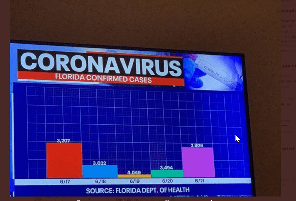

## R basics

1.  Critique the scripts below

```{r}
# Ebola Sierra Leone analysis
# John Sample-Name Doe
# 2024-01-01

# Load packages ----
if(!require(pacman)) install.packages("pacman")
pacman::p_load(
  tidyverse,
  inspectdf,
  plotly,
  janitor,
  visdat
)

# Load data ----
ebola_sierra_leone <- read_csv("~/Downloads/ebola_sierra_leone.csv")

# Explore data ----
head(ebola_sierra_leone)
tail(ebola_sierra_leone)
nrow(ebola_sierra_leone) 
ncol(ebola_sierra_leone) 
dim(ebola_sierra_leone)

cat_summary <- inspect_cat(ebola_sierra_leone)
# call the `show_plot()` function on that summmary.
show_plot(cat_summary)
```

# Data wrangling

1.  For each of the following datasets, describe in words how you would perform the analyses

    ```{r}
    <- read_csv(here("week_01/data/anonymized_quiz_data.csv")) 
    ```

# Data viz

Critique each of the following data visualizations below. In what ways are they not ideal? How might they be improved?

## 1. Zimbabwe New COVID cases

{width="535"}

[Image source](http://www.mohcc.gov.zw/index.php?option=com_phocadownload&view=category&id=15&Itemid=742)

## 2. Mean and standard deviation from an experiment

{width="529"}

[Image source](https://www.mpi.nl/sites/default/files/media/docs/brehm/Brehm_dataVis1.pptx)

## 3. Pet ownership percentages

{width="428"}

[Image source](https://math.scholastic.com/issues/2017-18/092517/fake-news-fake-data.html#1120L)

## **4. Confirmed COVID cases in Florida**

{width="432"}
