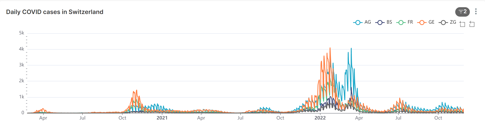

```{r include = FALSE}
knitr::opts_chunk$set(echo = FALSE)

# Load packages 
if(!require(pacman)) install.packages("pacman")
pacman::p_load(tidyverse, scales, lubridate, here)

```

# Activity 1 demo: Scales and Themes

Your assignment for Activity 1 is to recreate a plot from the
[EpiGraphHub COVID-19 Switzerland
dashboard](https://epigraphhub.org/superset/dashboard/11) in R using
{ggplot2}.

The graph we are aiming for looks like this:



Now most of the elements shown here you have already learned how to
create: line graph, group into regions by color, add labels.

However, there are additional modifications we want to make to the
scales and themes.

I will demonstrate how to do this using a fake dataset

```{r}
# Create fake dataset
sample_df <- data.frame(
  month = rep(1:12, each = 31),
  day = rep(1:31, 12),
  fake_cases = sample(0:10000, size = 31*12),
  district = rep(c("D1", "D2", "D3"), 124)
  ) %>% 
  mutate(date = ymd(paste("2022", month, day, sep = "-"))) %>% 
  drop_na() 
```

```{r}
# Create base plot

base_plot <- 
  ggplot(data = sample_df, 
       aes(x = date, 
           y = fake_cases, 
           color = district)) +
  geom_line() +
  labs(title = "Daily fake cases in imaginary districts")

base_plot
```

To-do

1.  Change background from gray to white

2.  Relabel x-axis scale breaks to month abbreviations

3.  Remove axis titles

4.  Remove most grid lines

5.  Relabel y-axis scale breaks to shorten 1000s to "k"

```{r}
base_plot +
  theme_minimal() +
  scale_x_date(date_breaks = "3 months",
               labels = label_date_short()) +
  theme(axis.title = element_blank(),
        panel.grid.minor = element_blank(),
        panel.grid.major.x = element_blank())

```

Four out of five tasks done!

Now, I leave the last and final step up to you. Do some web searches to
learn how to shorten the y-axis labels.

If you have a hard time finding a good answer, check out [this
page](https://www.roelpeters.be/scale-ggplot-y-axis-millions-or-thousands-r/).
