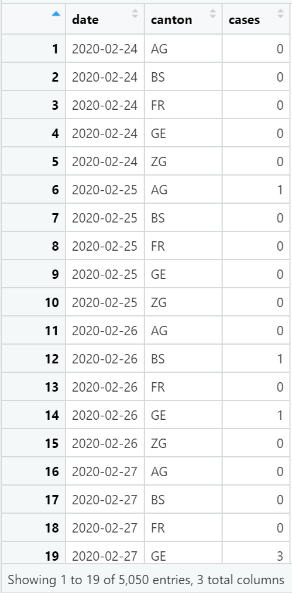

```{r include = FALSE}
knitr::opts_chunk$set(echo = FALSE)

# Load packages 
if(!require(pacman)) install.packages("pacman")
pacman::p_load(tidyverse, scales, lubridate, here)
```

# Intro

Welcome!

For this workshop, we have two activities. You will be completing
Activity 1 in this Rmd.

The assignment should be submitted individually, but you are encouraged
to brainstorm with partners.

The final due date for Activity 1 is Tuesday, December 6th at 23:59 PM
UTC+2.

# Instructions

Your assignment for Activity 1 is to recreate a plot from the
[EpiGraphHub COVID-19 Switzerland
dashboard](https://epigraphhub.org/superset/dashboard/11) in R using
{ggplot2}.

1.  First choose one of the four line graphs shown on the dashboard.
    This is the one you will recreate.

2.  Download the data associated with your chosen plot by clicking the
    three dots on the top right on the plot and selecting "Export CSV"

3.  Once downloaded, move the CSV to the "data" folder of this R
    project.

# Prepare the data

Now, **read the dataset into R**. Remember to use the `here()` function
to allow your Rmd to use project-relative paths.

```{r}
sw_covid_raw <- "WRITE_YOUR_CODE_HERE"
```

This data needs some cleaning before we can plot it.

This is what it looks like now:

{width="315"}

And this is what we want it to look like:

{width="371"}

## **Step 1:** Pivot from wide to long

Think about which columns need to be pivoted and give these to the
`cols` argument of `pivot_longer()`

```{r}
sw_covid_long <- "WRITE_YOUR_CODE_HERE"
```

## **Step 2:** Rename variables

Use `rename()` to change the column names to match the image above.

```{r}
sw_covid <- "WRITE_YOUR_CODE_HERE"
```

Now it's ready for plotting!

# Recreate desired plot

We want a plot that looks like the one on the website!

This can be done in several steps. See the demo Rmd for more :)

```{r}
"PLOT!"
```

# Submission: Upload Rmd and HTML

Once you have finished the tasks above, you should **knit this Rmd into
an HTML** and **upload both files** on the assignment page in a ZIP
folder.
